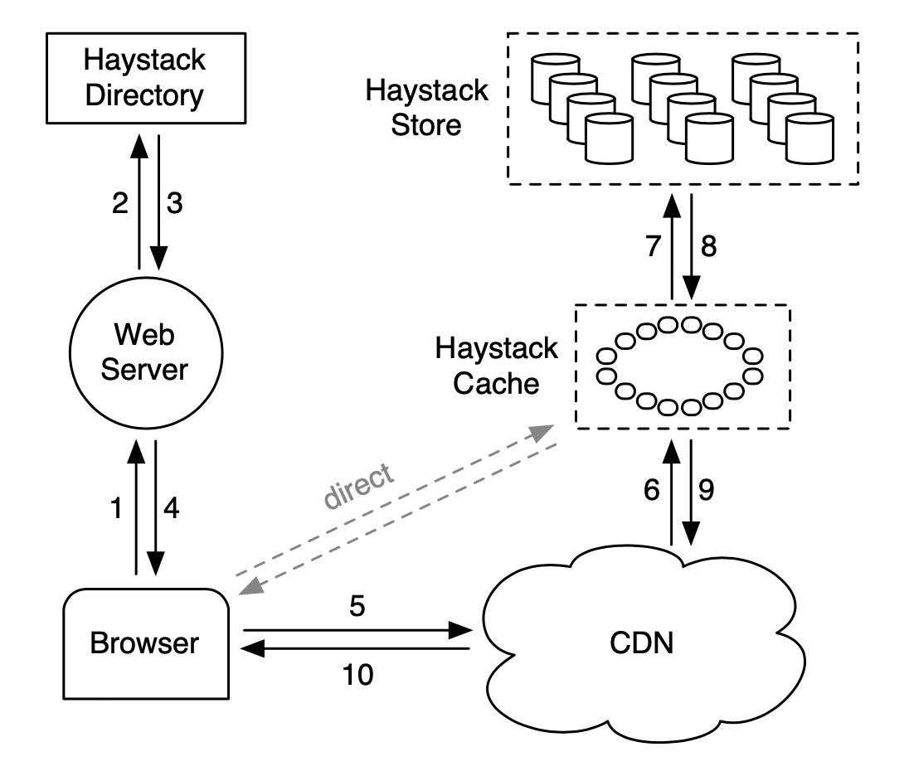
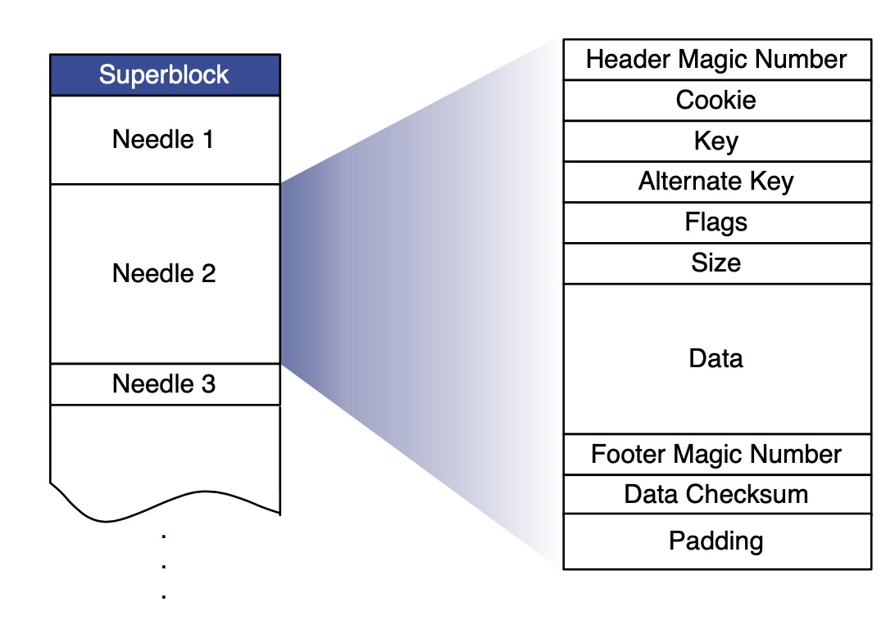
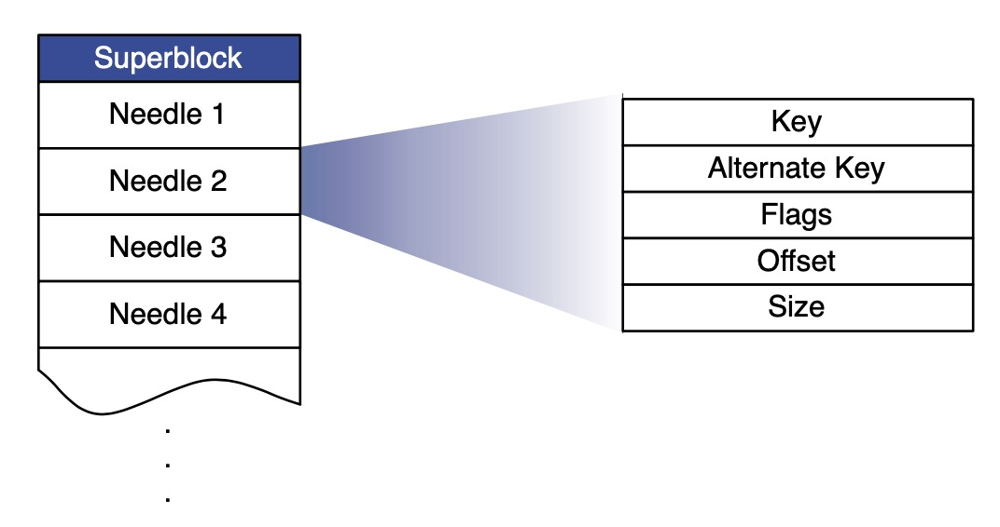

# Finding a needle in Haystack: Facebook’s photo storage

## 前言

发表时间：2010/10/04

这篇文章介绍了Facebook在存储海量小文件时遇到的问题，现有方案的瓶颈，并因此催生了Haystack。Haystack的设计中，主要技术决策的选择均有完善的线上数据支撑，而不是拍脑袋臆想，这是这篇文章给我最大的启发。

## 摘要

 Haystack是面向Facebook的海量照片存储需求而设计的对象存储系统。相比之前NFS+NAS的存储方案，Haystack更经济、性能更高。
 原方案无法将全部metadata保存在内存中，因此查找metadata时的多次磁盘操作成为了系统的性能瓶颈。
 因此Haystack对metadata进行精简，使之能完全保存在内存中，从而提高系统的吞吐。

## 正文

### 1 Introduction

Facebook有260billion存量图片，用户每周上传1billion新图片。对存储的业务需求可概括为written once, read often, never modified, rarely deleted。
传统POSIX文件系统面对海量小文件性能很差，获取一张图片至少要经过3次磁盘IO：

1. 文件名转inode；
2. 读取inode；
3. 读取文件。

步骤1通常不止一次IO，因为目录和单个文件的metadata较大，无法全部缓存在内存中。对于读请求，先前方案将全站资源托管到CDN。
吸取先前方案的不足，Haystack要能做到以下几点：

* 高吞吐低时延
  * 通过精简metadata，将精简后的metadata全量缓存在内存中，以实现读一张图片只需要一次IO。
* 容灾
  * 冗余备份+故障机替换
* 成本
  * 只将热点托管给CDN
* 简单

### 2 Background & Previous Design
1. Facebook的照片资源不适合全部托管给CDN，因为很大一部分都是冷资源，命中率低，没有命中的资源会回源，徒然花费成本却得不到任何收益。
2. 在存储系统上(NFS+NAS)，由于metadata很大(目录+文件)，导致无法缓存全部meta在内存中，部分缓存的话又因为都是冷资源，缓存命中率不高。
### 3 Design & Implementation
对于Background中提到的两个问题，Haystack是这样解决的
1. 只将热资源托管给CDN
2. 将很多图片小文件存放在一个大的操作系统文件中，从而精简meta，打造能缓存全部metadata的用户态存储系统
#### 3.1 架构概览
Haystack由Haystack Store, Haystack Directory, Haystack Cache组成。
1. Store的容量被规划为一系列physical volume(每个physical volume对应一个操作系统文件)，并将多个Store的physical volumes规划为一个logic volume互为备份;

2. Directory管理logic volume到physical volume的映射;

3. Cache作用类似CDN,处理从Browser或从CDN发来的请求。

   URL示例: http://CDN/Cache/<Machine id>/<Logical volume, Photo>
   
   Haystack是一个分布式存储系统，我们将metadata区分为Application metadata(browser生成的URL)和Filesystem metadata(用于host定位到文件)
#### 3.2 Directory
Directory的功能为
1. 管理logic volume --> physical volume 的映射关系
2. 负载均衡。调度均衡logical volume间的写负载，physical volume间的读负载
3. 根据资源冷热，判断请求发给CDN还是Cache
4. 标记Read-Only的logic volume(Read-Only可能是运维设置的,也可能是存储容量达到上限了)
#### 3.3 Cache
缓存的CacheKey为PhotoID，两个从实践中得出的缓存策略非常重要 
* 只缓存来自Browser的请求，而不缓存来自CDN的请求
  * 原因 来自CDN的请求下次会命中CDN，Cache缓存这类资源是徒劳，会降低命中率
* 只缓存来自WriteEnable-Store的资源，而不缓存来自ReadOnly-Store的资源
  * 原因1 Facebook的图片在刚创建时访问最为频繁，随着时间推移访问量会迅速下降，因此ReadOnlyStore中总是保存极冷资源
  * 原因2 Store同时服务写请求和读请求时，性能会下降。Cache可以使WriteEnableStore很难接到读请求
#### 3.4 Store

每个Store管理多个physical volume，每个volume约100GB，可容纳几百万照片。Store通过volumeID(相当于文件名)+offset获取到照片，这些信息都维护在内存中。
每个Volume的内部结构如下，每个Needle的data部分即为photo。


* Cookie 由Directory生成的随机数，增大恶意请求命中资源的难度
* Key PhotoID
* AlternateKey 尺寸ID
* Flags 删除标记位

##### 3.4.1 读请求

```go
type ReadRequest struct {
	LogicalVolumeID
  Key
  AlternateKey
  Cookie
}
```

通过LogicalVolumeID+Key+AlternateKey从内存元表中完成metadata lookup，获得Offset并读出Needle，校验Cookie+完整性，成功后返回。

##### 3.4.2 写请求

```go
type WriteRequest struct {
	LogicalVolumeID
  Key
  AlternateKey
  Cookie
  Data
}
```

每个Store将Data同步写入磁盘并更新内存元表。对于更新请求，如果位于不同LogicVolume，由Directory记录最新LogicVolume，如果位于相同Volume，写请求更新内存元表这一操作也会将Offset重置为最新，这种情况下最新版本永远是Offset最大的那个。

##### 3.4.3 删除请求

直接设置Flags

##### 3.4.4 索引文件

reboot时需要加载内存元表，虽然可以直接读Volume，但这样很耗时，索引文件可以优化重载时间。每个Volume都有一个索引文件，索引文件的Needle顺序与Volume严格保持一致。



为了避免因更新索引文件产生额外的磁盘IO，写请求时索引文件是异步更新的，删除请求时不更新索引文件。异步带来了一致性上的副作用：

* 孤儿Needle：实际存在的Needle没有被记录在索引文件中
  * 解决方案：索引文件中的最后一个Needle是最后一个非孤儿Needle，因此可从这里开始继续加载后面的孤儿Needle
* 索引文件无法感知被删除的Needle
  * 获取到Needle后检查Flags位

##### 3.4.5 文件系统

Store使用XFS，原因如下：

* 连续大文件的blockmaps足够小
* 提供有效的文件预分配机制，能更好支持建立在大文件基础上的volume

#### 3.5 Recover

#### 3.6 优化

##### 3.6.1 压缩

这里压缩指回收已被删除的存储空间

##### 3.6.2 节约内存

当前Haystack存储一个photo的meta约消耗10字节，对比来看XFS上每个文件的meta为536字节。

而且Haystack还可以进一步减少meta中的字段，压缩meta。

##### 3.6.3 批量上传

批量上传类似于上传一个大文件，影集上传就属于这种场景。

### 4 Evaluation

这章是一些体现在数据上的评估

